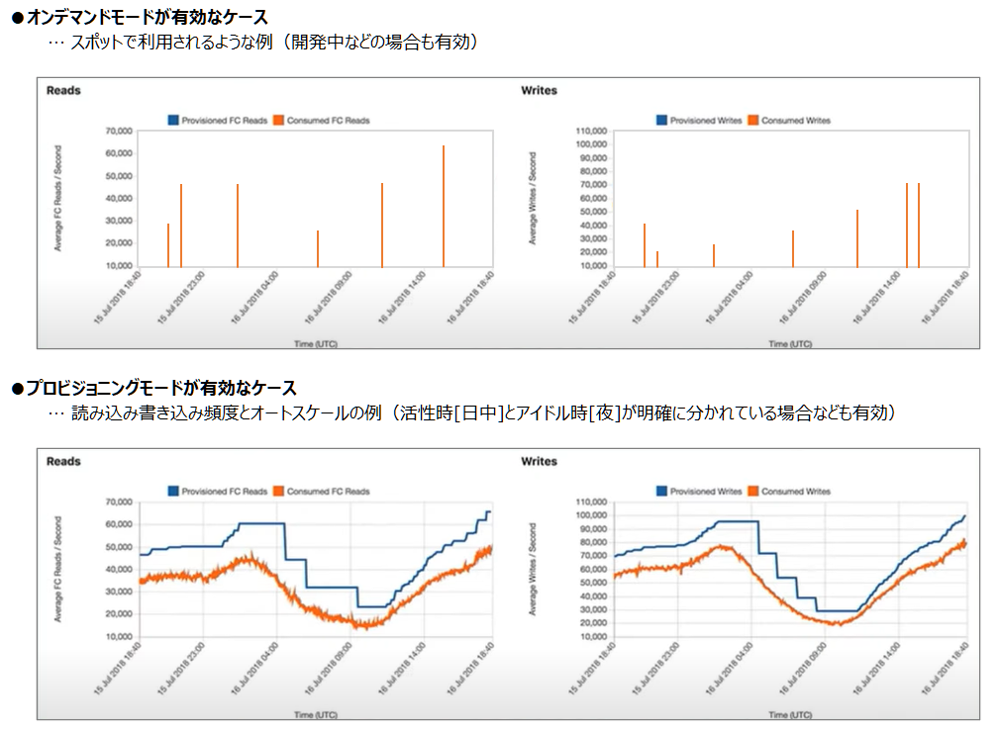

=== Amazon DynamoDBの概要
NoSQL（Key-Value型・スキーマレス） データベースサービスであり、シームレスなスケーラビリティを備えた高速で予測可能なパフォーマンスと、高い可用性と耐久性を備えたマネージドサービス

* Key-Value型（JSON形式）のデータベースである
* スキーマレスなので、RDBのようにデータ保存前にカラム名やデータ型を事前に定義する必要はない（キー属性以外）
* スケーラビリティは最大項目数の上限がないなど優れており、予測可能なパフォーマンスは<<スループット（読み取り／書き込みキャパシティユニット）>>にて実現している
* 高い可用性と耐久性は、3つのAZにデータ保存し、3つのAZで分散してトランザクションを処理することで実現している
* マネージドサービスなので構築や運用（ハードウェアのプロビジョニング、ソフトウェアパッチ適用、レプリケーション、バックアップ取得・復元など）が簡単な設定のみで実現可能である
* 従量課金制（処理性能に対する料金 ＋ ストレージ料金 ＋ オプション料金）
* 種類として２つのテーブルクラスがある
** Amanzon DynamoDB Standard：スループットコストが低い（デフォルト設定）
** Amazon DynamoDB Standard-Infrequent Access (DynamoDB Standard-IA)：ストレージコストが低い（アクセス頻度の低いデータを保存するテーブルとして優れている）
*** ストレージコストがテーブルのスループットコスト（処理性能に対する料金）の 50% を超える場合には、DynamoDB Standard-IA へ切り替えたほうがコスト効率が良い

==== 主な提供機能
[cols=3*,options="header",cols="25,40a,15,20a"]
|===
| 機能 | 説明 | オプション + 
（追加料金） | 補足

| テーブルの操作 | CRUD、スループット設定によるスケールアップ・ダウン含む | － | APIでの操作は<<コントロールプレーン API>>参照

| データの操作 | * CRUD（複数処理・トランザクション・読み込み整合性などのパターン含む） + 
* 有効期限（TTL）設定による期限切れデータの自動削除
| － | APIでの操作は<<テーブルの項目に対する操作API（データプレーン API と トランザクション API）>>参照

| 保管時の暗号化 | 保管時に自動で暗号化して保存する | － | －

| バックアップと復元 | * 完全バックアップ／差分バックアップの取得
* 継続バックアップの取得（35日間）
* ポイントタイムリカバリによる35日間の任意の時点へのテーブル復元
| ○ | －

| DynamoDB Streams | * DynamoDBテーブル内の項目レベルの変更に関するシーケンスを時間順にキャプチャする
* トリガーとしても利用可能（項目の変更を検知しlambda関数を実行するなど） | ○ | 最大 24 時間ログに保存

|DynamoDB Accelerator (DAX)  | * DynamoDB と互換性のあるキャッシュサービス
* 整合性データへのアクセス時に素早い対応を実現できる
| ○ | 
* リードスルーキャッシュ
* ライトスルーキャッシュ

| グローバルテーブル | DynamoDB テーブルを AWS リージョン間で同期させることが可能 | ○ | 
－

| 変更データキャプチャ | テーブル項目レベルのデータ変更をキャプチャし複製する

* Amazon Kinesis Data Streams
* AWS Glue
| ○ | －

| S3へのエクスポート・インポート | バックアップのS3への保管、それを利用した復元 | 
 ○ | 超長期のバックアップ＆復元として利用可能

|===

==== そのほかのよくある機能
* IAMを利用した認証・認可制御
* AWS Management Console を使用して、リソースの使用率とパフォーマンスメトリクスをモニタリング

=== 特徴的な考え方

==== スループット（読み取り／書き込みキャパシティユニット）
DynamoDBのテーブルのスループット（処理性能）は、以下の３つで定まる。

* 読み取りキャパシティユニット（RCU）と書き込みキャパシティユニット（WCU）の数
* DBのデータ操作に対する整合性（結果整合性のある読見込み、強い整合性のある読み込み、トランザクションのある読み込み／書き込み）
* 処理対象の項目データのサイズ 

その関係を示したのが下表になる。

[cols=5*,options="header",cols="20,20,40a,10,40a"]
|===
| キャパシティユニット
| 内容
2+| DBのデータ操作に対する整合性と必要キャパシティユニット数 + 
* 読み込み時のデータ基準：最大サイズ4KBの項目 + 
* 書き込み時のデータ基準：最大サイズ1KBの項目
| 補足

.3+| 読み込みキャパシティユニット（RCU）
.3+| 1秒あたりに読み込む容量の単位
| 強力な整合性のある読み込み + 
（成功した書き込み処理が反映された最新データを保証）
| 1個
.3+| * 読み込み処理（GetItem、Query、Scan）で消費される
* 強力な整合性のある読み込みはグローバルセカンダリインデックス (GSI) では利用できない
* 4KB以上の項目の場合、追加でRCUが必要になる
| 結果整合性のある読み込み + 
（最新ではないレプリカデータを読み込む可能性がある**[※1]**）
| 0.5個
| トランザクション処理中の読み込み
| 2個

.2+| 書き込みキャパシティユニット（WCU）
.2+| 1秒あたりに書き込める容量の単位
| 通常の書き込み + 
（1つのキーのデータに対する更新順序は保障）
| 1個
.2+|  * 書き込み処理（PutItem, UpdateItem, DeleteItemなど）で消費される
* 1KB以上の項目の場合、追加でWCUが必要になる
| トランザクション処理中の書き込み
（トランザクション中で操作するキーすべてのデータに対する更新順序をオールorナッシングで保障）
| 2個
|===

[※1] :: 書き込み処理では、3つのAZのうち特定のAZに対してデータ更新が行われれば書き込み処理完了となるが、その後に、残りの2つのAZおよびセカンダリインデックスに対してレプリケーション（射影）を行うことになる。 + 
「結果整合性のある読み込み」では、この射影がまだ終わっていない状態のAZのテーブルもしくはセカンダリインデックスのデータを読み込んでしまい、古いデータが返される場合がある（数ミリ秒間の想定）。 + 
おそらくだが、「強力な整合性のある読み込み」では、書き込み処理で定まる特定のAZを必ず読み込みに行くのではないかと予想される。

上記を参考に、RCU/WCUはテーブルやセカンダリインデックスに対して指定・変更することで、期待する処理性能を柔軟にスケーリングできる。

==== スループットの支払い料金を設定するモード
DynamoDBのスループットに対する支払い方法として、2つの方法がある。 + 
この2つは既存テーブルに対しても、切り替え可能である（24時間に1回）。

オンデマンドモード:: 
* 従量課金の処理性能に対する料金は、読み取りおよび書き込みリクエストのリクエストごとの支払い料金
* 容量計画なしで 1 秒あたりに数千ものリクエストを処理できる柔軟な請求オプション
** 直近（約30分）のトラフィックより必要なスループットを予測し自動的に対応するモード（直前のトラフィックより最大2倍まで処理可能）

プロビジョニングモード（デフォルト設定）::
* 従量課金の処理性能に対する料金は、読み取り／書き込みキャパシティユニットの数
* 対象テーブルの読み込み／書き込みキャパシティユニット数に応じて時間料金がかかる請求オプション
* Auto Scaling を使用することで、トラフィックの変更に応じて、読み込み／書き込みキャパシティユニット数を自動的に調整できる
* リザーブドキャパシティ（前払い契約することで読み込み／書き込みキャパシティーユニットを事前に予約すること）を利用することで、コストの削減を図れる

