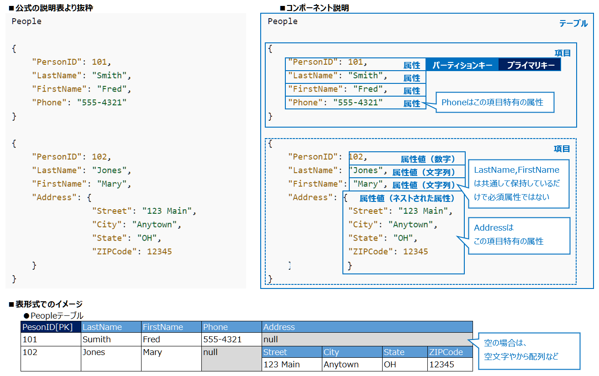
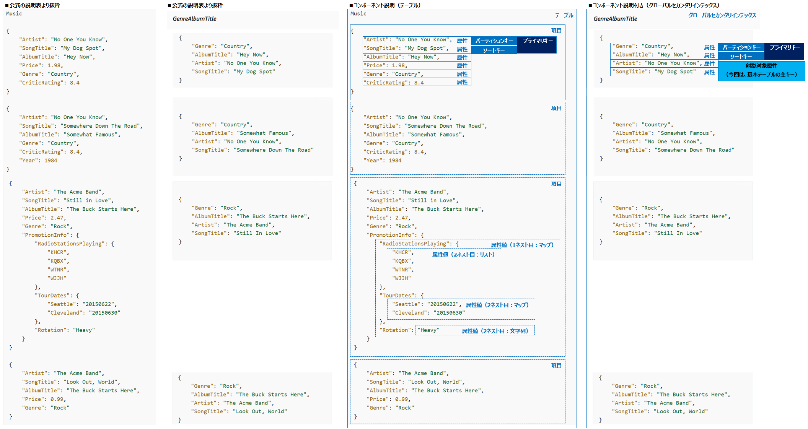
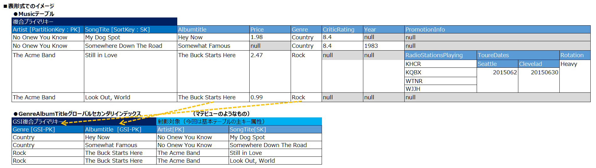
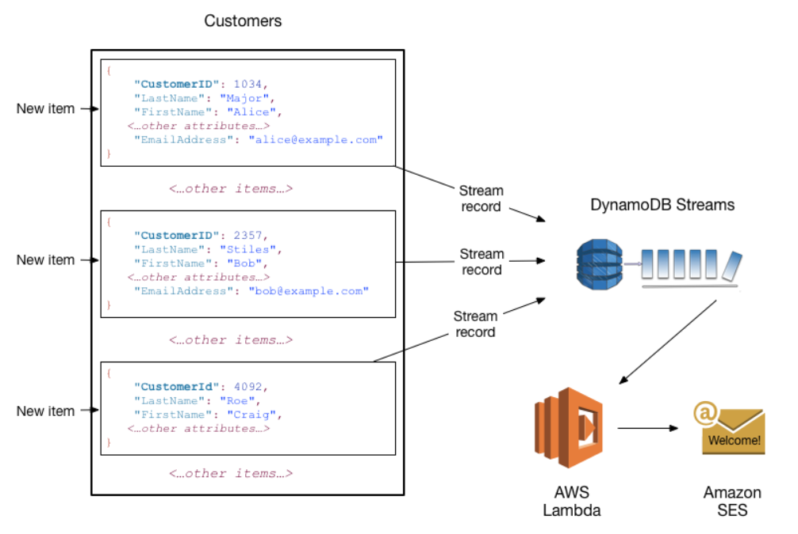

=== Amazon DynamoDBのコアコンポーネント

==== Amazon DynamoDBのコアコンポーネント一覧
[cols=4,options="header", cols="15,15,40a,30a"]
|===
| コアコンポーネント | RDBでの解釈 | 内容 | 備考

| テーブル | テーブル | データのコレクション・データを保存します | テーブルに保存できる項目数に制限なし

| 項目 | レコード or タプル | テーブル内で一意に識別可能な属性のグループ（集合） | 項目が保持する属性はプライマリキーだけが必須・他は増減自由 + 
項目の最大サイズ上限:400KB

| 属性 | カラム or フィールド | データ要素であり、それ以上分割する必要がないもの | 属性が保持できる値は、<<データ型>>参照

| プライマリキー | 主キー 
| 項目を一意に識別できるキー属性のこと、単一もしくは２つの属性（キー）からなる

* １属性の場合のキー属性： パーティションキー
* ２属性の場合のキー属性： パーティションキー ＋ ソートキー 
| ２属性以上の組み合わせのプライマリキーは指定はできない

| パーディションキー | 主キーの第1キー（必須） 
| プライマリキーに必須の第1属性のこと（別名：ハッシュ属性）
| パーティションキーの属性値のハッシュコードで項目が保存されるパーティション (DynamoDB 内部の物理ストレージ) が決まる

| ソートキー | 主キーの第2キー（任意） 
| * プライマリキーの第2属性のこと、無い場合もある（別名：範囲属性）
* テーブル検索の際の絞り込み条件として利用可能
| ソートキーバリューで並べ替えられた順に、DynamoDB が同じパーティションキーを持つ項目同士を物理的に近くに保存する

| セカンダリインデックス | 単一テーブルからなる更新できないマテリアライズドビュー 
| * 基本テーブルに対する検索用の別の複合プライマリキー（代替キー）をオーダー順に指定したビュー
* グローバルとローカルの2種類作ることが出来る

（公式：代替キーを使用して、テーブル内のクエリを行うことが出来る）
 | * データ実態を持つ（データを射影する） 
* 射影する属性値のみ検索・取得操作ができる
* 射影する属性はセカンダリインデックスの主キー属性と基本テーブルの主キー属性は必須、他の属性は任意

| ローカルセカンダリインデックス（LSI） | 同上 | 基本テーブルの同一パーティションキー値内において基本テーブルと異なるソートキーを検索対象にできる絞り込み用マテリアライズドビューのようなもの + 
（公式説明：パーティションキーはテーブルと同じですが、ソートキーが異なるインデックスです） 
| * 最大1テーブル5個
* テーブル作成後の追加不可
* パーティションキーの値ごとに 10GB のサイズ制限
* 射影対象の非キー属性は、すべてのセカンダリインデックスの合計で 100個 を超えてはなりません

| グローバルセカンダリインデックス（GSI） | 同上 | 基本テーブルのプライマリーと異なるの属性をプライマリキーに指定して並び変えた検索用のマテリアライズドビューのようなもの + 
（公式説明：パーティションキーおよびソートキーを持つインデックス。テーブルのものとは異なる場合があります。） 
| * 最大1テーブル20個
* テーブル作成後に追加可能 
* 射影対象の非キー属性は、すべてのセカンダリインデックスの合計で 100個 を超えてはなりません

| DynamoDB Streams | (トランザクションログのストリーミング) | テーブルのデータ変更イベントをキャプチャするオプション（ほとんどリアルタイムに、イベントの発生順にストリームに表示される） 

* 新しい項目がテーブルに追加された場合 + 
ストリームは、すべての属性を含む項目全体のイメージをキャプチャします。 + 
* 項目が更新された場合 + 
ストリームは、項目で変更された属性について、「前」と「後」のイメージをキャプチャします。
* テーブルから項目が削除された場合 + 
ストリームは、項目が削除される前に項目全体のイメージをキャプチャします。
 | DynamoDB Streams を AWS Lambda と共に使用して、トリガーを作成できる

|===

【?】セカンダリインデックスに指定するプライマリキー属性の値は、重複可能の認識でよいか…？（唯一に定まる必要があるか？）

==== Amazon DynamoDBのコアコンポーネントのサンプル・イメージ図

https://docs.aws.amazon.com/ja_jp/amazondynamodb/latest/developerguide/HowItWorks.CoreComponents.html[公式の表] に補足を追加したもののイメージ

* テーブル・項目・属性のイメージ

* 複合プライマリキー・グローバルセカンダリインデックスのイメージ

* DynamoDB Streams を AWS Lambda と共に使用してトリガーを作成した際のイメージ（ https://docs.aws.amazon.com/ja_jp/amazondynamodb/latest/developerguide/HowItWorks.CoreComponents.html[公式より抜粋]）

==== データ型と命名規則
===== 命名規則
* すべての名前は UTF-8 を使用してエンコードする必要があり、大文字と小文字が区別されます。

[cols=3,options="header", cols="40,20,40"]
|===
| コンポネント | 文字長 | その他制限
| テーブル名 
.2+| 3～255 文字 
.2+| 文字種制限（a-z、A-Z、0-9、_下線、-ダッシュ/ハイフン、.ドット）のみ
| インデックス名

| GSI/LSIのパーティションキー名
.3+| 1～255文字 
.3+| <<予約語>>、<<特殊文字>>の利用非推奨
| GSI/LSIのソートキー名
| LSIのユーザー指定の射影された属性名

| 属性名（上記以外） | 1文字以上、64KB未満 | <<予約語>>、<<特殊文字>>の利用非推奨
|===
* （補足）属性名がストレージとスループットの使用量の測定に含まれるため、出来るだけ短くすることがベストプラクティス

===== データ型
* 共通して以下の制限があります
** 可変長なデータの場合
*** DynamoDB 項目の最大サイズ上限が 400 KBまで
*** シンプルなプライマリキーのパーティションキーの属性値として利用する場合の最大長： 2,048 バイト
*** 複合プライマリキーのソートキーの属性値として利用する場合の最大長：1,024 バイト

[cols=3,options="header", cols="20,20,60a"]
|===
| データ型の分類 | データ型 | 補足

.5+| スカラー型
| 数値 | * 正、負、または 0 （最大精度：38桁）
* エポックタイムを使用することで、日付またはタイムスタンプを数値データ型で表すことが可能

| 文字列 | * UTF-8のUnicode
* 最小文字長0
* https://en.wikipedia.org/wiki/ISO_8601[ISO 8601] の表記を使って日付またはタイムスタンプを叔父列データ型で表すことが可能
| バイナリ | * 圧縮テキスト、暗号化データ、イメージなど、任意のバイナリデータが保存できる
* アプリケーションではbase64エンコードしてDynamoDBへの送信が必要、DynamoDBでは符号なしのバイト配列にデコードしてそのバイナリ属性の長さとして使用
* バイナリ値の比較では、各バイナリデータを符号なしとして扱う
* 空のバイナリ可
* 【？】属性がインデックスまたはテーブルのキーとして使用されず、DynamoDB 項目の最大サイズ上限が 400 KB に制約されている場合、バイナリ属性の長さは 0

| ブール値 | ture または　false
| NULL | 不明または未定義の状態を表す

.2+|ドキュメント型
| リスト | * 順序付きの値のコレクション
* リスト要素に保存できるデータ型に制限はなく、リスト要素の要素が同じ型である必要はありません
* 例：`FavoriteThings: ["Cookies", "Coffee", 3.14159]`

| マップ | * 順序なしの名前と値のペアのコレクション + 
* マップの要素に保存できるデータ型に制限はなく、マップの要素が同じ型である必要はありません + 
* 例： + 
`{` + 
`    Day: "Monday",` + 
`    UnreadEmails: 42` + 
`    ItemsOnMyDesk: [` + 
`        "Coffee Cup",` + 
`        "Telephone",` + 
`        {` + 
`            Pens: { Quantity : 3},` + 
`            Pencils: { Quantity : 2},` + 
`            Erasers: { Quantity : 1}` + 
`        }` + 
`    ]` + 
`}` + 

| セット| セット | * 数値、文字列、またはバイナリ値のセットを表す型をサポート
* セット内の要素はすべて、同じ型である必要があります
* 各値は一意である必要があります
* 設定内の値の順序は保持されません
* 空のセットはサポートされていないが、空文字・空バイナリデータは許可
* 例：`["Black", "Green", "Red"]`

|===

===== 特殊文字
以下の文字はDynamoDBで特殊な意味を持つので、属性名での利用は非推奨

* # (ハッシュ) 
* : (コロン) 
* . (ドット) 

===== 予約語
* DynamoDBの予約語（574文字）、属性名としての使用禁止、大文字と小文字が区別されません。
[source, sql]
----
ABORT
ABSOLUTE
ACTION
ADD
AFTER
AGENT
AGGREGATE
ALL
ALLOCATE
ALTER
ANALYZE
AND
ANY
ARCHIVE
ARE
ARRAY
AS
ASC
ASCII
ASENSITIVE
ASSERTION
ASYMMETRIC
AT
ATOMIC
ATTACH
ATTRIBUTE
AUTH
AUTHORIZATION
AUTHORIZE
AUTO
AVG
BACK
BACKUP
BASE
BATCH
BEFORE
BEGIN
BETWEEN
BIGINT
BINARY
BIT
BLOB
BLOCK
BOOLEAN
BOTH
BREADTH
BUCKET
BULK
BY
BYTE
CALL
CALLED
CALLING
CAPACITY
CASCADE
CASCADED
CASE
CAST
CATALOG
CHAR
CHARACTER
CHECK
CLASS
CLOB
CLOSE
CLUSTER
CLUSTERED
CLUSTERING
CLUSTERS
COALESCE
COLLATE
COLLATION
COLLECTION
COLUMN
COLUMNS
COMBINE
COMMENT
COMMIT
COMPACT
COMPILE
COMPRESS
CONDITION
CONFLICT
CONNECT
CONNECTION
CONSISTENCY
CONSISTENT
CONSTRAINT
CONSTRAINTS
CONSTRUCTOR
CONSUMED
CONTINUE
CONVERT
COPY
CORRESPONDING
COUNT
COUNTER
CREATE
CROSS
CUBE
CURRENT
CURSOR
CYCLE
DATA
DATABASE
DATE
DATETIME
DAY
DEALLOCATE
DEC
DECIMAL
DECLARE
DEFAULT
DEFERRABLE
DEFERRED
DEFINE
DEFINED
DEFINITION
DELETE
DELIMITED
DEPTH
DEREF
DESC
DESCRIBE
DESCRIPTOR
DETACH
DETERMINISTIC
DIAGNOSTICS
DIRECTORIES
DISABLE
DISCONNECT
DISTINCT
DISTRIBUTE
DO
DOMAIN
DOUBLE
DROP
DUMP
DURATION
DYNAMIC
EACH
ELEMENT
ELSE
ELSEIF
EMPTY
ENABLE
END
EQUAL
EQUALS
ERROR
ESCAPE
ESCAPED
EVAL
EVALUATE
EXCEEDED
EXCEPT
EXCEPTION
EXCEPTIONS
EXCLUSIVE
EXEC
EXECUTE
EXISTS
EXIT
EXPLAIN
EXPLODE
EXPORT
EXPRESSION
EXTENDED
EXTERNAL
EXTRACT
FAIL
FALSE
FAMILY
FETCH
FIELDS
FILE
FILTER
FILTERING
FINAL
FINISH
FIRST
FIXED
FLATTERN
FLOAT
FOR
FORCE
FOREIGN
FORMAT
FORWARD
FOUND
FREE
FROM
FULL
FUNCTION
FUNCTIONS
GENERAL
GENERATE
GET
GLOB
GLOBAL
GO
GOTO
GRANT
GREATER
GROUP
GROUPING
HANDLER
HASH
HAVE
HAVING
HEAP
HIDDEN
HOLD
HOUR
IDENTIFIED
IDENTITY
IF
IGNORE
IMMEDIATE
IMPORT
IN
INCLUDING
INCLUSIVE
INCREMENT
INCREMENTAL
INDEX
INDEXED
INDEXES
INDICATOR
INFINITE
INITIALLY
INLINE
INNER
INNTER
INOUT
INPUT
INSENSITIVE
INSERT
INSTEAD
INT
INTEGER
INTERSECT
INTERVAL
INTO
INVALIDATE
IS
ISOLATION
ITEM
ITEMS
ITERATE
JOIN
KEY
KEYS
LAG
LANGUAGE
LARGE
LAST
LATERAL
LEAD
LEADING
LEAVE
LEFT
LENGTH
LESS
LEVEL
LIKE
LIMIT
LIMITED
LINES
LIST
LOAD
LOCAL
LOCALTIME
LOCALTIMESTAMP
LOCATION
LOCATOR
LOCK
LOCKS
LOG
LOGED
LONG
LOOP
LOWER
MAP
MATCH
MATERIALIZED
MAX
MAXLEN
MEMBER
MERGE
METHOD
METRICS
MIN
MINUS
MINUTE
MISSING
MOD
MODE
MODIFIES
MODIFY
MODULE
MONTH
MULTI
MULTISET
NAME
NAMES
NATIONAL
NATURAL
NCHAR
NCLOB
NEW
NEXT
NO
NONE
NOT
NULL
NULLIF
NUMBER
NUMERIC
OBJECT
OF
OFFLINE
OFFSET
OLD
ON
ONLINE
ONLY
OPAQUE
OPEN
OPERATOR
OPTION
OR
ORDER
ORDINALITY
OTHER
OTHERS
OUT
OUTER
OUTPUT
OVER
OVERLAPS
OVERRIDE
OWNER
PAD
PARALLEL
PARAMETER
PARAMETERS
PARTIAL
PARTITION
PARTITIONED
PARTITIONS
PATH
PERCENT
PERCENTILE
PERMISSION
PERMISSIONS
PIPE
PIPELINED
PLAN
POOL
POSITION
PRECISION
PREPARE
PRESERVE
PRIMARY
PRIOR
PRIVATE
PRIVILEGES
PROCEDURE
PROCESSED
PROJECT
PROJECTION
PROPERTY
PROVISIONING
PUBLIC
PUT
QUERY
QUIT
QUORUM
RAISE
RANDOM
RANGE
RANK
RAW
READ
READS
REAL
REBUILD
RECORD
RECURSIVE
REDUCE
REF
REFERENCE
REFERENCES
REFERENCING
REGEXP
REGION
REINDEX
RELATIVE
RELEASE
REMAINDER
RENAME
REPEAT
REPLACE
REQUEST
RESET
RESIGNAL
RESOURCE
RESPONSE
RESTORE
RESTRICT
RESULT
RETURN
RETURNING
RETURNS
REVERSE
REVOKE
RIGHT
ROLE
ROLES
ROLLBACK
ROLLUP
ROUTINE
ROW
ROWS
RULE
RULES
SAMPLE
SATISFIES
SAVE
SAVEPOINT
SCAN
SCHEMA
SCOPE
SCROLL
SEARCH
SECOND
SECTION
SEGMENT
SEGMENTS
SELECT
SELF
SEMI
SENSITIVE
SEPARATE
SEQUENCE
SERIALIZABLE
SESSION
SET
SETS
SHARD
SHARE
SHARED
SHORT
SHOW
SIGNAL
SIMILAR
SIZE
SKEWED
SMALLINT
SNAPSHOT
SOME
SOURCE
SPACE
SPACES
SPARSE
SPECIFIC
SPECIFICTYPE
SPLIT
SQL
SQLCODE
SQLERROR
SQLEXCEPTION
SQLSTATE
SQLWARNING
START
STATE
STATIC
STATUS
STORAGE
STORE
STORED
STREAM
STRING
STRUCT
STYLE
SUB
SUBMULTISET
SUBPARTITION
SUBSTRING
SUBTYPE
SUM
SUPER
SYMMETRIC
SYNONYM
SYSTEM
TABLE
TABLESAMPLE
TEMP
TEMPORARY
TERMINATED
TEXT
THAN
THEN
THROUGHPUT
TIME
TIMESTAMP
TIMEZONE
TINYINT
TO
TOKEN
TOTAL
TOUCH
TRAILING
TRANSACTION
TRANSFORM
TRANSLATE
TRANSLATION
TREAT
TRIGGER
TRIM
TRUE
TRUNCATE
TTL
TUPLE
TYPE
UNDER
UNDO
UNION
UNIQUE
UNIT
UNKNOWN
UNLOGGED
UNNEST
UNPROCESSED
UNSIGNED
UNTIL
UPDATE
UPPER
URL
USAGE
USE
USER
USERS
USING
UUID
VACUUM
VALUE
VALUED
VALUES
VARCHAR
VARIABLE
VARIANCE
VARINT
VARYING
VIEW
VIEWS
VIRTUAL
VOID
WAIT
WHEN
WHENEVER
WHERE
WHILE
WINDOW
WITH
WITHIN
WITHOUT
WORK
WRAPPED
WRITE
YEAR
ZONE 
----

===== データ型