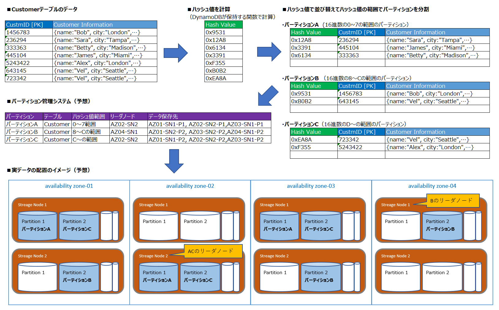

=== Amazon DynamoDBのアーキテクチャ（2018時点）
* AWS re:Invent 2018: Amazon DynamoDB Under the Hood: How We Built a Hyper-Scale Database (DAT321)
** https://www.youtube.com/watch?v=yvBR71D0nAQ[YouTube（AWS re:Invent 2018：DAT321）]

==== DynamoDBの更新処理の仕組みとAutoAdmin
* DynamoDBの更新処理の仕組みとAutoAdminのイメージ図（１リクエストで関わるもののみ記載）
image:./images/01-0201-01.png["DynamoDBの更新処理の仕組みのイメージ図"]

* 仕組みの役割と更新時の主な動き

[cols="4*", options="headers", cols="10,10,50a,15a"]
|===
| 仕組み | 意味 | 役割 | 補足

| Request Router（RR）
| リクエストルータ
| DynamoDBのAPIの受け口、以下を実施し、応答を返却する + 
　①ユーザからのリクエストを受け付け + 
　②認証・認可の確認（Authentication System） + 
　③リーダノード[※1]を取得（Partition Metadata System） + 
　④リーダノード[※1]に更新処理を送信（Strage Node） + 
　⑥更新処理の成否を応答を受信 + 
　⑦ユーザにレスポンスを返却
| ステートレスなRRは複数存在し、ユーザはどのRRに到達してもよい

| Authentication System
| AWSの認証認可システム
| IAMのポリシーを利用し、対象ユーザが実行可能な権限を持っているかどうか評価するシステム
| －

| Partition Metadata System（PMS）
| パーティション管理システム
| リーダーノード[※1]を管理するシステム
| －

| Strage Node（SN）
| ストレージノード
| 実際にデータを保存・更新処理をしているノード、以下の3つのデータを保存・管理する + 
* B-tree：プライマリキー値に基づくインデックス + 
* ReplicationLog：操作ログ + 
* SSD：実データを保存・バックアップ + 
なお、データ更新時は自身を更新し「⑥レプリケート処理を行う」この際、異なるAZに２つあるストレージノードのうちの１つの更新処理が完了した段階で「⑥更新処理の成否を応答」を実施する
| 3つのストレージノードの内の1つが故障していたとしても、2つが成功すれば成功とみなし、処理が正常に継続できるようにしている

| Auto Admin
| 自動管理
| DynamoDBの心臓部となる仕組み、主に以下のような役割を持つ + 
* テーブルの作成・削除などを実際に行う + 
　（パーティション分割・SNの新規作成/削除など） + 
* 障害が発生していないか確認し、障害が発見されれば修復する + 
　（SNを作り直したり、リーダーを変更したり） + 
* PMSが最新であることを確認する
| －

|===

[※1]:: 更新処理の場合は順序性の担保のため、３つのAZに存在する３つのストレージノードの中にリーダーとなるストレージノードが存在しており、これを更新してからレプリケーション対象のAZのストレージノードが更新される仕組みとなっている、そのリーダーの役割を担うストレージノードのことを、リーダノードと呼ぶ

* テーブル更新後のセカンダリインデックスの更新
セカンダリインデックスが設定されていた場合は、テーブルが更新された後に、非同期的にセカンダリインデックスの値も更新される。 + 
セカンダリインデックスもテーブルと同様に3つのAZのストレージノードに保存されているので、テーブルデータの更新を受け取る「LogPopagator」から、リーダーノードに対して更新処理が依頼され、残り2つのストレージノードに対してレプリケーション処理を行う。 + 
セカンダリインデックスに対して強い参照整合性のある読み込みが実施できないのは、この非同期更新の動きのためである。

==== パーティションとデータ分散
DynamoDBのデータは、パーティションと呼ばれる単位で分散して保管される。 + 
パーティションはテーブルのパーティションキーのハッシュ値で並び替えた範囲により定まり、ストレージノードの特定のパーティション領域に保存する（ソートキーがある場合はその順で物理的に近い場所に保存される）。 +  
このため、１つのテーブルに対する操作でもパーティションキーが異なれば、異なるストレージノードに対する処理となるため分散処理が可能で高速に処理できる。 + 
逆に、同じパーティションキーに対する操作は１つのストレージノードが処理することになるため分散処理されず、分散処理できる場合に比べて遅くなることが予想されるため、パーティションキー値は適度に分散処理されるように設計することが必要である。 + 
なお、１つのパーティションに対するスループットの上限は定まっており、この上限を超えた性能が必要であればDynamoDB側で適切にパーティションが分割される。

* テーブルとパーティションとストレージノードの関連のイメージ

* 1つのパーティションにおけるスループットの上限
|===
| 対象 | 上限値
| 書き込みキャパシティユニット | 1000 WCU
| 読み込みキャパシティユニット | 3000 RCU
| データ量 | 10GB
|===

プロビジョニングモードでキャパシティを指定する場合、テーブルに対しての指定になるのでパーティションごとの指定はできない、例えば、テーブルで 1200WCU が指定されており、DynamoDB内部的に3つのパーティションに分割された場合、各パーティションに割り当てられる WCU は均等に 400WCU づつで処理される。 + 
また、実際はDynamoDBが上手く処理してくれてキャパシティユニットの利用に偏りがある場合は、上記の上限を超えない範囲で WCU の割り当て率を変えたり、パーティションを新たに分割したりするらしい。

