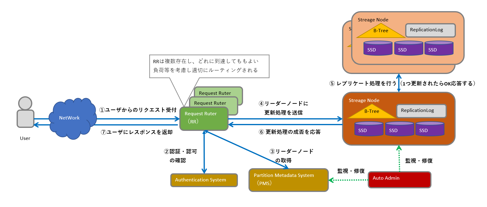

=== Amazon DynamoDBのアーキテクチャ（2018時点）
* AWS re:Invent 2018: Amazon DynamoDB Under the Hood: How We Built a Hyper-Scale Database (DAT321)
** https://www.youtube.com/watch?v=yvBR71D0nAQ[YouTube（AWS re:Invent 2018：DAT321）]

==== DynamoDBの更新処理の仕組みとAutoAdmin
* DynamoDBの更新処理の仕組みとAutoAdminのイメージ図（１リクエストで関わるもののみ記載）

* 仕組みの役割と動き更新時の主な動き
|===
| 仕組み | 意味 | 役割 | 補足

| Request Router（RR）
| リクエストルータ
| DynamoDBのAPIの受け口、以下を実施し、応答を返却する + 
　①ユーザからのリクエストを受け付け + 
　②認証・認可の確認（Authentication System） + 
　③リーダノード[※1]を取得（Partition Metadata System） + 
　④リーダノード[※1]に更新処理を送信（Strage Node） + 
　⑤ユーザにレスポンスを返却
| ステートレス、RRは複数存在し、ユーザはどのRRに到達してもよい

| Authentication System
| AWSの認証認可システム
| IAMのポリシーを利用し、対象ユーザが実行可能な権限を持っているかどうか評価するシステム
| －

| Partition Metadata System（PMS）
| パーティション管理システム
| リーダーノード[※1]を管理するシステム
| －

| Strage Node（SN）
| ストレージノード
| 実際にデータを保存・更新処理をしているノード、以下の3つのデータを保存・管理する + 
* B-tree：プライマリキー値に基づくインデックス + 
* ReplicationLog：操作ログ + 
* SSD：実データ + 
なお、データ更新時は自身を更新し、④の応答を返したのち、⑥[非同期]レプリケート処理 を行う
| －

| Auto Admin
| 自動管理
| DynamoDBの心臓部となる仕組み、主に以下のような役割を持つ + 
* テーブルの作成・削除などを実際に行う（パーティション分割・SNの新規作成/削除など）
* 障害が発生していないか確認し、障害が発見されれば修復する（SNを作り直したり、リーダーを変更したり）
* PMSが最新であることを確認する

| －

|===