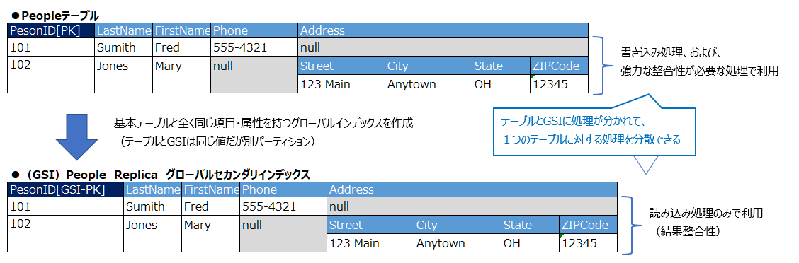

=== DynamoDBにおける設計の考え方

==== 設計おけるDynamoDBと一般的なRDBの違い
[cols="4", options="headers", cols="10,30a,30a,10"]
|===
| データベース | DynamoDB | 一般的なRDB | 補足
| 設計のベース | アクセスパターン +
 （ユーザが必要とするデータパターン） | データモデル（正規化） | －
| 設計時の思想 | 必要なデータパターンをそのまま格納・そのまま取得、大量トランザクションを高速に処理可能に | 重複を排除した最小データの格納（正規化）と必要なデータパターンに合わせて加工（テーブル結合・集計等）したデータの取得 | －
| 最も重要視するパフォーマンス | コンピューティング最適 | ストレージ最適 | －
| 特徴
| * 処理が早い（格納済みのデータパターンのデータを取得する場合）
* 大量のトラフィックの処理が可能（並列スケール可能）
* DBに上手く格納されていないデータパターンのデータの取得はほぼできない（大変コストがかかる）
* 取得時にデータを加工（テーブル結合・集計等）することはできない 
* トランザクションは1データ1更新の組み合わせを1回のリクエストで大量に同時実施する（DBへの複数のリクエストをまたぐ長時間のトランザクションは存在しない）
| * 処理が遅い（一般的にNoSQLと比べて）
* 大量のトラフィックの処理には高性能なハード投資が必要となる（垂直スケール可能）
* 複雑なデータパターンでも、データ取得時のクエリの工夫で取得可能
* トランザクションは、アプリケーション処理とDB処理を相互に実施するような長時間に及ぶ処理も実施可能
| －

| 主な設計対象 | データ格納時の値の格納方法（スキーマ設計）、キー設計 | 事前のスキーマ定義・参照整合性制約の関連などのテーブル設計 | － 

| 最適なテーブル数 | アプリケーションでできるだけ少なく（理想は1個） | 正規化された意味のあるデータ毎に１つ | －

| 最適なワークロード 
| * ソーシャルネットワーク
* ゲーム
* メディア共有
* Internet of Things (IoT) を含む
* ウェブスケールアプリケーション 
| * アドホッククエリ
* データウェアハウス
* OLAP (オンライン分析処理)
| －

|===

==== DynamoDBの設計/利用時のポイント
NOTE:: [※]はAWSデベロッパーガイドのベストプラックティスで紹介あり（イメージ後述） + 
（コスト最適化やセキュリティなどは一旦範囲外として、データベース設計に限定）

[cols="4", options="headers", cols="10a,10a,30a,30a"]
|===
2+| 対象 | 役割・注意点 | 補足

2+| テーブル 
| * アクセスパターンに合わせてデータを格納 + 
* 主に更新処理を行う際に利用 
| 大量データの更新処理時はパーティションを効率的に使えるように処理順を考慮する[※1]
.2+| プライマリキー設計 
| パーティションキー 
| * 【超重要】対象が適切に指定出来て、かつ、パーティションが適切に分割するように設計する[※2]
| アプリケーションで同時処理される可能性のあるデータ同士が異なるパーティションになる
| ソートキー 
| * アプリケーションで同時に処理される可能性のあるデータがソート順で並ぶようにする 
* 特定パーティション内の検索項目として利用できるので、アクセスパターンで抽出したい処理がある場合にうまく抽出できるような値を設定する[※3]
* バージョンコントロールに利用する目的でソートキーにバージョン番号を追加する[※3]
| －

2+| グローバルセカンダリインデックス設計（GSI）
| * 【超重要】主に複数データの検索処理を行う際に利用
** 基本テーブルに対する更新と参照処理を分離する目的で、レプリカ[※4]として基本テーブルと同一のGSIを作成し利用することもある
* アクセスパターンを実現するための最適なGSIのプライマリキーの設計が重要（各キー設計の注意点はプライマリキーと同様）
* スパースインデックス[※5]を利用して、操作対象のデータ量を最小化し処理性能の向上を図る 
* 多重定義[※6]を意識した設計により、1つのGSIで様々なのデータの取得操作を提供できるようにする
* 多対多の関連を持つデータ構造に対して、基本テーブルのパーティションキーとソートキーを逆に持つGSIを持つことで表現できる（隣接関係のリスト）[※7]

| 強力な整合性のある検索は実施できない

2+| ローカルセカンダリインデックス設計（LSI）
| * 同一パーティションで異なるソートキーで並び替えて処理したい場合の検索処理で利用
| 強力な整合性のある検索も可能、ただし、キャパシティユニットをテーブルと共有するため、並列処理には向かない可能性あり

2+| Amazon DynamoDB Streams + Lambda設計
| * 集計の結果を格納・計算したい場合に利用[※8]
| 多少の遅延があっても問題ない場合に利用可能
|===

==== DynamoDBのベストプラックティス
NOTE:: コスト最適化やセキュリティなどは一旦範囲外として、データベース設計・使い方に限定

[※1]（大量データ更新）パーティションを効率的に使える処理順イメージ ::
ホットパーティションを作らないように、パーティションの異なる項目を順に処理する。

[※2]（パーティションキー）パーティションキー設計イメージ:: 
ホットパーティションを作らず、DynamoDBのパーティションに対する処理が均一的に分散するように設計する。 + 
GSIやソートキーと組み合わせて、アクセスパターンに必要なデータをテーブルをscanせずに、まとめて取得できるようなキー設計が望ましい。 + 
複合プライマリキーの場合のパーティションキーの設計を処理の均一性から見た場合の良し悪しをまとめたものは以下の通り。

[cols="4*", options="headers", cols="15,10,40a,30a"]
|===
| パーティションキー値の例 | 均一性 | 理由 | 補足
| ステータスコード | × | 少数の値のいずれかが設定されるステータスコードの場合、１つのステータスに対して相当数の項目が紐づき十分なパーティション数に分割されないためよくない | 「スキーマ名」などデータの中身ではなく「種類」を識別する情報は良くない
| トランザクションID（※著書意見） | × | 複合プライマリキーにおいてデータを1件のみに識別するような情報をパーティションキーに指定してしまうと、ソートキー利用時のメリットがないのでよくない | 1件データはソートキー側にあるとよい
| 作成日付 | × | 直近の日付だけよく使われるなど、ホットパーティションになる事が容易に想像できるためよくない | 「作成日付」など統計的に絞り込みたい条件はソートキー側にあるとよい
| ユーザID | ○ | 多くの対象が存在し、同じ値で複数リクエスト同時に処理することがないような情報は均一性が高い | IOTの「デバイスID」など定期的・等頻度で処理するものなども有効
| ユーザID  + 
(処理の偏りあり) | × | バッチ処理等で大量に同時に処理されるなどする場合、ホットパーティションになり得るのでよくない | －
| ユーザID+予測可能な数値 +
 (処理の偏りあり)  | ○ | 処理量の偏りがありそうなユーザIDでも予測可能な数値でシャーディングすることで、ホットパーティションを回避できるので良い | １つのアクセスパータンで必要なデータが複数のパーティションキーで分散格納されているので、アプリケーション側でそこを理解して実装を行う必要がある
|===

[※3]（ソートキー）絞り込みでの活用とバージョンコントロールを活用するイメージ:: 
* 複合ソートキー：
ソートキーは演算子による範囲指定を利用して、Queryを発行できるため、それを活用出来るように検索対象となる属性を複数組み合わせた「複合ソートキー」を作成して活用するとよい。
（詳細： https://docs.aws.amazon.com/ja_jp/amazondynamodb/latest/developerguide/Expressions.OperatorsAndFunctions.html#Expressions.OperatorsAndFunctions.Syntax[比較演算子および関数リファレンス]）

** 演算子：
*** = <> < <= > >=
*** a IN (a, b, c)　… a がリスト内の任意の値と等しい場合、true
*** BETWEEN a AND b　…a が b 以上で、c 以下である場合、true
*** 関数条件：attribute_exists + attribute_not_exists + begins_with contains
*** NOT(上記条件のいずれか) … 否定時に
*** 複数条件の指定時利用：AND,OR
** 複合ソートキーの例：
*** `[country]\#[region]#[state]\#[county]#[city]#[neighborhood]`

* ソートキーのバージョンコントロールの活用
最新バージョンを簡単に取得でき、監査目的の履歴も簡単に取得できるようにするベストプラックティス。
** 実装のコツ：
[cols="2", options="headers", cols="20a, 60a"]
|===
| 項目の処理 | 実装のコツ
| 新規作成時 | v0とv1の履歴を作成、v0に最新の履歴のプレフィックスを保持
| 更新時　| vX(v0のプレフィクス+1)を作成、v0を最新情報と履歴のプレフィックスをXで更新
| 最新取得時 | v0の項目を取得
| 履歴の一覧取得時 | 対象の項目すべてからv0を除外した一覧を取得 + 
（イメージ図の例：`Audit`で検索し、`v0`以外を抽出）
|===

[※4]（テーブルとGSI）GSIのレプリカで更新処理と参照処理の分離:: 
グローバルセカンダリインデックスをテーブルと全く同じ状態で作成し、1つのテーブルの1つのパーティションに集中する参照・更新処理を分離できる。 + 
RDBなどのリードレプリカ機能に該当する使い方、DB全体ではなくテーブル毎という違いがある。

[※5]（GSI）スパースインデックスを利用した処理性能向上のイメージ:: 
「スパース（=sparse）」とは、「すかすか」とか「まばらな」を意味する英語で、スパース性とは、物事の本質的な特徴を決定づける要素はわずかしかないという性質を示す言葉。 + 
GSIはテーブルの中で重要な意味を持つ属性をプライマリキーとすることで、その有無により、重要なデータしか抽出されていない、小さい表（GSI）を作り出し、テーブルに対する重いScan処理などを回避し、効率的に実施できるようにすること。 + 
トランザクション管理システムの場合のベストプラックティスの例として、テーブルにステータスとは別に"isOpen"という"現在有効"という属性を設けて、一番利用頻度の高い"有効データ"のみからなるGSIを対象に処理をするも紹介されている。

[※6]（GSI）多重定義のイメージ:: 
GSIはテーブルで20個までという制約があるため「1つの属性にデータの意味として異なる値を格納して、1つのGSIで、データの意味的には異なる様々な検索や抽出ができるようにしましょう」というのが、多重定義の意図するところ。 イメージとしては以下の通り。

[※7]（GSI）多対多のデータ構造に対する隣接関係のリストのイメージ:: 
多対多の関係を持つデータを表現したい場合に、テーブルのパーティションキーとソートキーと、その逆の属性をパーティションキーとソートキーにもつグローバルセカンダリインデックス（GSI）を用意することで表現できることを示している。 + 
例えば、大学の講義と受講する生徒のように、1つの生徒は複数の講義に参加し、１つの講義には複数の生徒が参加するような場合に、下記のテーブルでは生徒から見た講義の一覧が、GSIでは講義からみた生徒の一覧が取得できる。

[※8]（集計処理）Amazon DynamoDB Streams + Lambda を利用した集計処理:: 
Amazon DynamoDBではデータをス得する際に集計するような機能はないので、その代わりに、取得したい集計結果があるなら、その計算を格納時にして、集計結果をDBに保持しようというもの。
* 設定イメージ
** 集計行を用意
** 特定の行の更新を受けて、集計行を＋１するLambda関数を用意
** テーブルにAmazon DynamoDB Streamsを有効化
** 集計行を更新する処理が行われた場合（図の例ではダンロードされた行が追加された場合）をトリガーにLambda関数を実行するように設定
* 動作イメージ
** 集計行を更新する処理（ダウンロード行追加）された場合に、Lambda関数で集計行を更新
